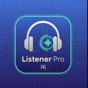

# Listener Pro AI — v3.0 Groq Edition

> Real-time AI conversational support. Speak. AI listens. AI responds. Repeat.



## What It Does

**Listener Pro** is a progressive web app that gives you a real-time AI co-pilot for conversations — whether you're in a tough talk, a sales call, a coaching session, or just want to think out loud.

### Two Modes

**👂 Whisper Mode** — AI listens to a live conversation and whispers coaching cues back to you. Four sub-modes:
- 💚 **Supportive** — Short validating phrases ("I hear you.", "That makes sense.")
- 💛 **Engaged** — One curious follow-up question per turn
- ❤️ **Logical** — Calm objective counter-point
- 💙 **Baseline** — De-escalation and mediation phrases

**🧠 Session Mode** — Direct AI conversation with four personas:
- 🧠 **Therapist** — CBT-informed reflective listening
- 💼 **Sales Coach** — Roleplay as a prospect or get coaching feedback
- 🪞 **Devil's Advocate** — Stress-tests your thinking
- 🧭 **Life Coach** — Goals, obstacles, action steps

---

## How It Works

```
Mic → VAD → Groq Whisper STT → Groq LLM (streaming) → Web Speech TTS
```

- **VAD** (Voice Activity Detection) — detects when you stop speaking and auto-sends
- **Groq Whisper** — transcribes your speech, typically in ~200–400ms
- **Groq LLM** — streams a response using your chosen model
- **Web Speech API** — speaks the response back; VAD is gated while AI speaks so it can't hear itself
- **⚡ Manual override** — force a reply at any time

---

## Setup

### 1. Get a Groq API Key

Free at [console.groq.com](https://console.groq.com). Your key starts with `gsk_`.

### 2. Deploy

**Option A — GitHub Pages (recommended)**
1. Fork or clone this repo
2. Go to repo **Settings → Pages → Source → Deploy from branch → main / root**
3. Visit `https://yourusername.github.io/listener-pro`
4. Enter your Groq key on first launch — stored locally, never sent anywhere except Groq

**Option B — Local**
```bash
# Serve with any static server (required for mic permissions over HTTPS or localhost)
npx serve .
# or
python3 -m http.server 8080
```
Then open `http://localhost:8080`

> ⚠️ Microphone access requires HTTPS in production. GitHub Pages provides this automatically.

### 3. Install as PWA

On mobile: tap **Share → Add to Home Screen** (iOS) or the install banner (Android/Chrome).  
On desktop: click the install icon in the address bar.

---

## Models

### LLM (configurable in Settings)

| Model | Tag | Notes |
|---|---|---|
| `llama-3.3-70b-versatile` | DEFAULT | Best quality, recommended |
| `llama-3.1-8b-instant` | FASTEST | Ultra-low latency, lighter |
| `llama3-70b-8192` | BALANCED | Long context (8k tokens) |
| `mixtral-8x7b-32768` | LARGE CTX | 32k context for long sessions |

### STT (configurable in Settings)

| Model | Notes |
|---|---|
| `whisper-large-v3` | Highest accuracy, recommended |
| `whisper-large-v3-turbo` | ~2x faster, minimal accuracy trade-off |

---

## Features

- 🎯 **VAD with silence threshold** — configurable 400ms–2000ms (Settings)
- 🔊 **TTS voice selector** — any browser voice, with test button
- 💬 **Streaming responses** — words appear as they generate
- 📊 **Pipeline timing** — see STT and LLM latency live
- 📋 **Session history** — auto-saves with AI-generated summaries
- 🔒 **Lock sessions** — protect important sessions from deletion
- 📝 **Session notes** — attach personal notes to any session
- 📤 **Export** — full transcripts and summaries as .txt
- 💼 **Sales templates** — save prospect profiles with auto-fill from company URL
- 👁 **Ghost Mode** — blank screen with tap-to-change-mode corners (stealth use)
- 📦 **Import/Export** — backup and restore all data as JSON
- 🔌 **Offline-capable** — app shell cached by service worker

---

## File Structure

```
listener-pro/
├── index.html              # Full app (single file)
├── manifest.json           # PWA manifest
├── sw.js                   # Service worker
├── favicon.ico
├── apple-touch-icon.png    # iOS home screen icon (180x180)
├── icon-72x72.png
├── icon-96x96.png
├── icon-128x128.png
├── icon-144x144.png
├── icon-152x152.png
├── icon-192x192.png
├── icon-384x384.png
├── icon-512x512.png
└── icon-512x512-maskable.png
```

---

## Privacy

- Your Groq API key is stored in `localStorage` — never transmitted anywhere except directly to `api.groq.com`
- Audio is processed locally by your browser's microphone APIs
- No analytics, no tracking, no backend
- All session history is stored in `localStorage` on your device

---

## License

MIT — use freely, modify freely.
